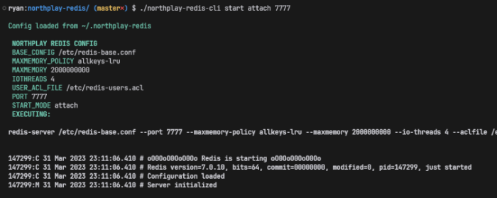

## Northplay Redis Helper
CLI to help easily run multiple redis nodes, used for development.



## CLI
### Commands
CLI commands are as following:

#### `northplay-redis-cli start [START_MODE] [PORT]`
Starts a redis node, `[START_MODE]` is either `attached` or `screened`.

#### `northplay-redis-cli status [PORT]`
Wraps `lsof -i :[PORT]` and shows this to you.

#### `northplay-redis-cli config`
Shows current config used, stored in `$HOME/.northplay-redis`.

#### `northplay-redis-cli config reset`
Resets stored config values in `$HOME/.northplay-redis` to default ones.


### Install CLI
To install `northplay-redis-cli`:
```shell
sudo cp northplay-redis-cli /usr/local/bin/northplay-redis-cli
sudo chmod +x /usr/local/bin/northplay-redis-cli
sudo cp ./redis-users.acl /etc/redis-users.acl
sudo cp ./redis-base.conf /etc/redis-base.conf
```

The `redis-users.acl` contains the redis user and redis password.

## Install Redis
### Prepare Host

Install screen so we can start multiple redis standalone nodes: 
`sudo apt-get install screen`

Install lsof for process status:
`sudo apt-get install lsof`

Sysctl config set values:

```shell
sudo echo vm.overcommit_memory = 1 | sudo tee -a /etc/sysctl.conf
sudo echo fs.inotify.max_user_watches = 524288 | sudo tee -a /etc/sysctl.conf
sudo echo net.ipv6.conf.all.disable_ipv6 = 1 | sudo tee -a /etc/sysctl.conf
sudo echo net.ipv6.conf.default.disable_ipv6 = 1 | sudo tee -a /etc/sysctl.conf
sudo echo fs.file-max = 1000000 | sudo tee -a /etc/sysctl.conf
```

Reload sysctl:
```shell
sudo sysctl -p
```

### Install by package manager
Commands for ubuntu:
```shell
sudo apt install lsb-release
curl -fsSL https://packages.redis.io/gpg | sudo gpg --dearmor -o /usr/share/keyrings/redis-archive-keyring.gpg
echo "deb [signed-by=/usr/share/keyrings/redis-archive-keyring.gpg] https://packages.redis.io/deb $(lsb_release -cs) main" | sudo tee /etc/apt/sources.list.d redis.list
sudo apt-get update
sudo apt-get install redis
```

### Compile from source
Getting and building from source:

```shell
sudo mkdir install && cd install
sudo echo vm.overcommit_memory = 1 | sudo tee -a /etc/sysctl.conf
sudo sysctl -p
sudo wget https://download.redis.io/redis-stable.tar.gz
sudo tar -xzvf redis-stable.tar.gz
sudo cd redis-stable
sudo make distclean BUILD_TLS=yes
sudo make install BUILD_TLS=yes
```

## Laravel Config
### Example `.env`
```shell
REDIS_USERNAME="redis_user_1"
REDIS_PASSWORD="ffaf11fewfqeqqvVVd203c493aa99"
REDIS_HOST=127.0.0.1
REDIS_PORT=5379
REDIS_DB=2
REDIS_CACHE_DB=3

```
### Example `config/database.php`

```shell
    'redis' => [

        'client' => env('REDIS_CLIENT', 'phpredis'),

        'options' => [
            'cluster' => env('REDIS_CLUSTER', 'redis'),
            'prefix' => env('REDIS_PREFIX', Str::slug(env('APP_NAME', 'laravel'), '_').'_database_'),
        ],

        'default' => [
            'host' => env('REDIS_HOST', '127.0.0.1'),
            'username' => env('REDIS_USERNAME'),
            'password' => env('REDIS_PASSWORD'),
            'port' => env('REDIS_PORT', '6379'),
            'database' => env('REDIS_DB', '4'),
        ],

        'cache' => [
            'host' => env('REDIS_HOST', '127.0.0.1'),
            'username' => env('REDIS_USERNAME'),
            'password' => env('REDIS_PASSWORD'),
            'port' => env('REDIS_PORT', '6379'),
            'database' => env('REDIS_CACHE_DB', '5'),
        ],

    ]

```